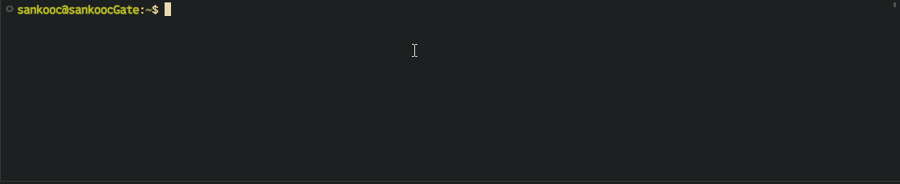

---

# Symbols 



### Prerequisites

Install the patched fonts of powerline nerd-font. Have a look at the [Nerd Font README](https://github.com/ryanoasis/nerd-fonts/blob/master/readme.md) for more installation instructions. Don't forget to setup your terminal in order to use the correct font.

### Install

install from source:

```sh
cargo install --git https://github.com/sankooc/symbols.rs.git --branch main
```
